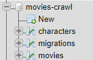

# api:crawl

Desenvolvimento um web crawler a partir da API do Studio Ghibli com objetivo de salvar todas as informações básicas da API de filmes e seus respectivos personagens e formatar ela em banco de dados.

## Ambiente de desenvolvimento

  - PHP 7.1
  - Xampp
  - MySQL
  - Template AdminLTE
  - Desenvolvido no Windows 10
 
## Estrutura do banco

- Tabelas: movies, characters, migrations

## Estado da aplicação

O sistema atual lista todos os filmes (Nome, descrição, diretor, produtor, ano e score do Rotten Tomatoes) e personagens (Nome, gênero, idade, cor dos olhos, cor dos cabelos).

- Página de filmes

- Página de pessoas
